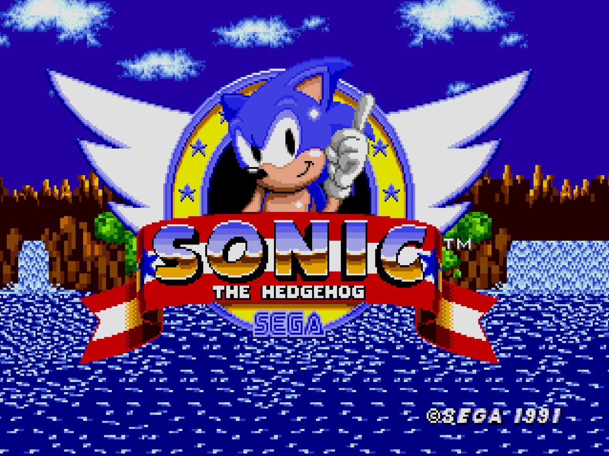
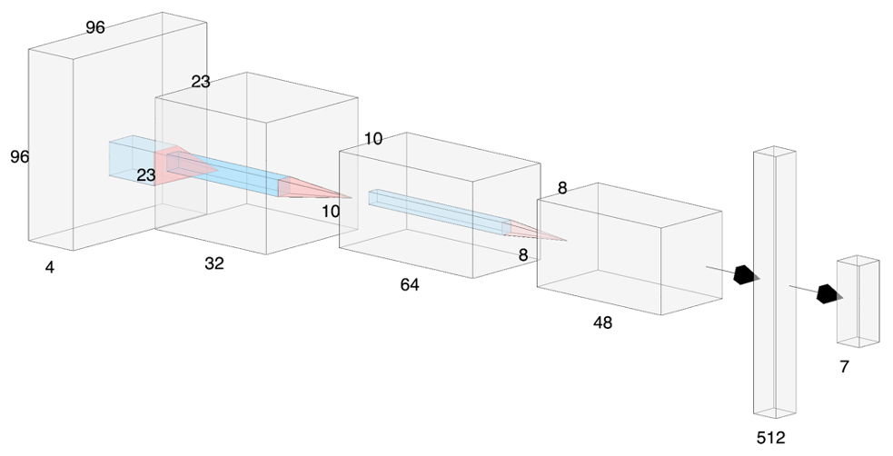

# Sonic Deep Reinforcement Learning 



## Project Overview

For my passion project at Metis I wanted to focus on learning about a machine learning paradigm we didn't cover in the course, reinforcement learning (RL). Reinforcement learning and the neural network version of the discipline, deep reinforcement learning (DRL), are technically challenging fields that have techniques that are very unique and where training models can be very time intensive. 

**The goal of my project was to create a deep reinforcement learning agent that can complete the first level of Sonic the Hedgehog.** 

However, reinforcement learning and the neural network version of the discipline, deep reinforcement learning (DRL), are technically challenging fields that have techniques that are very unique and where training models can be very time intensive. On top of that, implementing RL models for existing games has the additional challenge of creating APIs for them that allow the models to interact with them.

Fortunately OpenAI has famously created a framework for testing RL models on a broad assortment of classic games called [OpenAI Gym](https://gym.openai.com/). In addition, the Gym API also provides baselines for successful RL models, allowing users to more easily implement them and try their own approaches with the games available in Gym.  [Retro Gym](https://openai.com/blog/gym-retro/) adds many other emulated consoles and games into the Gym ecosystem, including the classic Sega game Sonic the Hedgehog.

I approached this primarily as a research project where I would be learning DRL through successful established models and approaches from experienced people and teams in the field. I wanted to come away with a solid conceptual understanding of DRL as well as good overview of the more effective models and underlying algorithms that applied to games, as opposed to trying to develop my own custom deep reinforcement learning model, which would have been a dissertation-level endeavor. 

In the end, after trying a number of algorithms, I was able to use an existing model and algorithm based on Proximal Policy Optimization (PPO) to create an AI agent that was able to very skillfully and quickly navigate the first level of Sonic the Hedgehog. This was really exciting to see and has inspired me to pursue more projects int he field. 

##Methodology

- Use established reinforcement learning models to build a model that can complete the first level of Sonic the Hedgehog. 


##Data

- As is typical with reinforcement learning models data to be used for training the model is generated through agent interaction with the game environment. It's not uncommon to bootstrap RL models with a pre-trained model or high level human player episodes, but in this case it wasn't necessary.  

## Tools

- Python
- PyTorch
- Tensorflow
- Amazon Web Services (AWS)
- OpenAI Gym
- OpenAI Retro-Gym
- Pandas 
- Numpy
- Seaborn
- Matplotlib


## Final PPO Model

Below is a high-level general breakdown of the final PPO model used to create the agent that successfully completed the level:

- Input: 4 preprocessed frames scaled down to 96x96 and grayscaled
- Convolution 1: Filters: 32, CNN Kernel: 8x8, Stride: 4
- ReLU Activation
- Convolution 2: Filters: 64, CNN Kernel: 4x4, Stride: 2
- ReLU Activation
- Convolution 3: Filters: 48, CNN Kernel: 3x3, Stride: 1
- Fully Connected Layer 1: 512
- Fully Connected Layer 2: 7
- This final FC layer will output one of the seven possible actions for the agent to take. 




## [Project Repository](https://github.com/torinrettig/Sonic-Deep-Reinforcement-Learning) 

### File Tree

```
├── README.md
├── code
│   ├── fast_agent.py
│   ├── fast_architecture.py
│   ├── fast_model.py
│   ├── fast_play.py
│   └── fast_sonic_env.py
├── models
├── presentation
│   └── super_sonic_presentation.pptx
└── writeup
    ├── images
    └── sonic_deep_reinforcement_learning_v2.md
```


### File Descriptions

* `README.md` - Description of projects libraries and files
* `code/` - Folder containing source data files and pickled files
  * `fast_agent.py` - Creates TensorFlow session to run agent through levels.
  * `fast_architecture.py` - Classes for Convolutional Neural Network and policy objects.
  * `fast_model.py` - Classes for PPO algorithm and supplementary functions for running models through the game.
  * `fast_play.py` - Run to play a model that has already been created through the game to see it's progress.
  * `fast_sonic_env.py` - Classes to establish agent behavior parameters, determine levels to target for modeling, and update model rewards.
* `models/` - A sampling of the models created. Not all were included for the sake of storage space. 
* `presentation/`
  * `super_sonic_presentation.pptx` - PowerPoint presentation used in the live presenation of project resulots.
* `writeup/`
  * `images/` - Images for the writeup and README.
  * `sonic_deep_reinforcement_learning_writeup.md` - Detailed writeup of the project.

##References

My research was extensive so to summarize I'll list the most useful/influential sources here: 

- [Playing Atari with Deep Reinforcement Learning](https://arxiv.org/abs/1312.5602) - This is the paper describing Google DeepMind's efforts with using Deep Reinforcement Learning to teach AI agents to play classic Atari games at or exceeding human levels of skill. This is widely-regarded as the effort that really legitimized DRL as an effective approach to solving complex systems and DRL efforts with games after this largely can be traced back to this. It introduces Deep Q-Learning , the precursor to many more advanced DRL techniques.
- [Explained Simply: How DeepMind taught AI to play video games](https://medium.freecodecamp.org/explained-simply-how-deepmind-taught-ai-to-play-video-games-9eb5f38c89ee) - Provided deeper understanding and explanations for the Atari paper above. 
- [Free Deep Reinforcement Learning Course](https://simoninithomas.github.io/Deep_reinforcement_learning_Course/) - The course mentioned above that I used as a primary roadmap for my RL research and modeling. It moves through increasingly complex RL models and techniques and was a superb guide and reference. 
- [Simple Reinforcement Learning with Tensorflow](https://medium.com/emergent-future/simple-reinforcement-learning-with-tensorflow-part-0-q-learning-with-tables-and-neural-networks-d195264329d0) - Another excellent tutorial series on reinforcement learning and its implementation in Tensorflow.
- [Deep Reinforcement Learning Hands On](https://www.packtpub.com/big-data-and-business-intelligence/deep-reinforcement-learning-hands) - My other primary reference and tutorial for DRL on this project. When the free tutorial wasn't providing results or depth of explanation I needed to get a full grasp of the space I sought out a more in-depth examination and this book ended up being an excellent reference, both for theory and actual implementation. 
- [Sonic the Hedgehog Retro Contest](https://openai.com/blog/retro-contest/) - Another reason why Sonic seemed like a very solvable problem space was because OpenAI had actually run a contest to challenge the public to come up with the most effective Sonic model. Exploration of these techniques was a rich research space and ended up providing the most definitive approaches to the modeling problem.
- [Gotta Learn Fast: A New Benchmark for Generalization in RL](https://arxiv.org/abs/1804.03720) - In this paper OpenAI lays out the foundation for the baseline model approaches to solve for an effective Sonic model. This was published before the contest and the contestants largely used variations of the described baselines to get the best results.
- [Alexadre Borghi's PPO Variant](https://github.com/aborghi/retro_contest_agent) - When the tutorial model approaches weren't getting great results I went straight to the source of the successful models that worked for the sonic contest. Alexandre Borghi placed 3rd and provided his model for others to experiment with. There were a few adaptations to make it work on my system and also to just focus on the first level, but the final successful model is primarily this one. 

## Resources

Links to project resources:

- [GitHub Repository](https://github.com/torinrettig/Sonic-Deep-Reinforcement-Learning) - Data, models, code, presentation and writeup for the project.

- [Blog Post @ torinrettig.net](https://torinrettig.net/Seattle_AirBnB_Project_Writeup/) - A much more detailed version of the Medium article, going into more depth on data processing, metrics and modeling.

  

